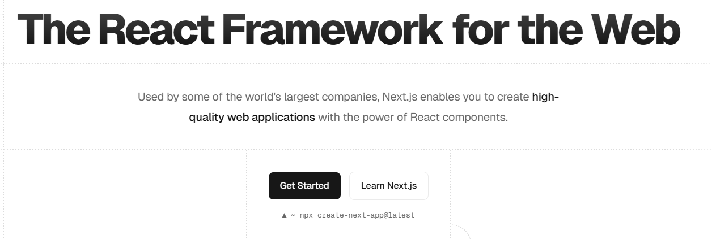
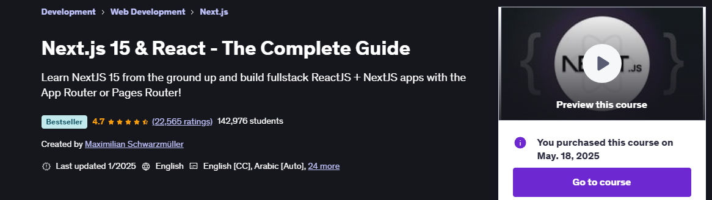

# nextjs

# Next.js 15 & React - The Complete Guide

Course: (https://www.udemy.com/course/nextjs-react-the-complete-guide/)  
Course length: <b>40.2 hours</b> 
Author: Maximilian Schwarzmüller 
 

Learn NextJS 15 from the ground up and build fullstack ReactJS + NextJS apps with the App Router or Pages Router!
 
### Life cycle of Course Outline:
| Section | Topics | Completed |
| ---: | --- | :---: |
| Section 01 | Getting Started |  |
| Section 02 | Optional: React Refresher |  |  
| Section 03 | NextJs Essentials (App router) |  |  
| Section 04 | Routing and Page rendering |  |  
| Section 05 | Data fetching - Deep Dive |  |  
| Section 06 | Mutation data |  |  
| Section 07 | Understanding & configuring cache |  |  

| Section 08 | Course Project - Directives |  |  
| Section 09 | Services & Dependency Injection |  | 
| Section 10 | Course Project - Services and Dependency Injection |  |  
| Section 11 | Changing Pages with Routing |  | 
| Section 12 | Course Project - Routing |  | 
| Section 13 | Observables |  | 
| Section 14 | Course Project - Observables |  |  
| Section 15 | Handling Forms |  |  
| Section 16 | Course Project - Forms |  |  
| Section 17 | Pipes to Tranform output |  |  
| Section 18 | Making Http Requests |  |  
| Section 19 | Course Project - Http |  |  
| Section 20 | Authentication and route protection |  |  
| Section 21 | Dynamic Components |  |  
| Section 22 | Modules & Optimizing Apps |  |  
| Section 23 | Deployment |  |  
